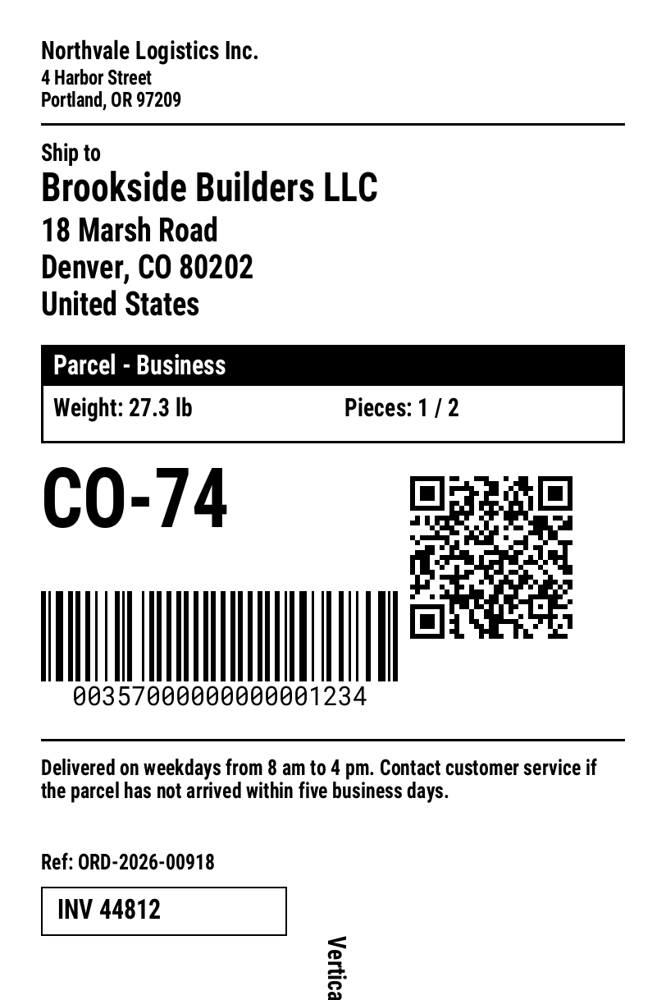
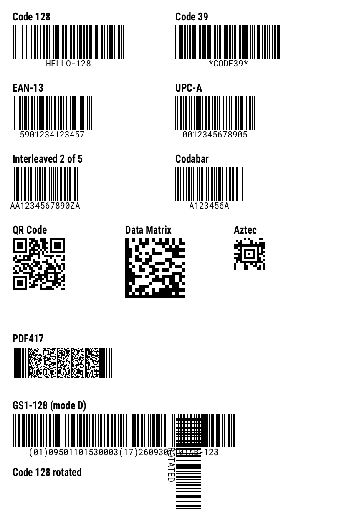
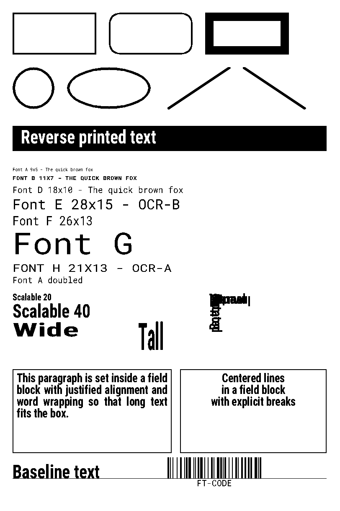

# ZPL

[](https://github.com/m-stilling/zpl-renderer-php/actions/workflows/tests.yml) [](https://packagist.org/packages/stilling/zpl-renderer)

Parse ZPL label code and render it to vector PDF or to PNG, without a printer and without an online service. One `^XA ... ^XZ` format becomes one PDF page or one PNG image. In the PDF, text stays text and bars, boxes and barcodes stay vector shapes, so the output is sharp at every zoom level.

```
composer require stilling/zpl-renderer
```

Requires PHP 8.3 with the `mbstring` and `zlib` extensions. PNG output needs the `gd` extension; PDF output does not.

<table>
<tr>
<th><a href="examples/shipping-label.zpl">Shipping label</a></th>
<th><a href="examples/barcodes.zpl">Barcodes</a></th>
<th><a href="examples/shapes-and-fonts.zpl">Shapes and fonts</a></th>
</tr>
<tr>
<td valign="top"></td>
<td valign="top"></td>
<td valign="top"></td>
</tr>
</table>

## Usage

```php
use Stilling\Zpl\Options;
use Stilling\Zpl\Zpl;

$zpl = '^XA^FO50,50^A0N,40,40^FDHello^FS^FO50,120^BCN,80,Y,N,N^FD12345678^FS^XZ';
$options = new Options(dpmm: 8, widthMm: 101.6, heightMm: 152.4);
$options = (new Options())->dpmm(8)->widthMm(101.6)->heightMm(152.4);

file_put_contents('label.pdf', Zpl::toPdf($zpl, $options));
file_put_contents('label.png', Zpl::toPng($zpl, $options));
```

- `Zpl::toPdf()` returns one PDF with a page per label, and a page per copy when `^PQ` asks for more.
- `Zpl::toPng()` returns one PNG. The third argument picks the label when the input holds several, counted from 0.
- `Zpl::toPngs()` returns a list with one PNG per label.
- `Zpl::parse()` returns the interpreted labels as a list of `Label` objects with their elements, for example to feed a different renderer.

The `$options` argument is optional. Without it, every method uses `new Options()`.

### Labels and elements

`Zpl::parse()` returns one `Label` per `^XA ... ^XZ` format. Every position and size in the model is in printer dots.

| Property | Type | Meaning |
| --- | --- | --- |
| `width`, `height` | `int` | Label size in dots. |
| `dpmm` | `int` | Print density in dots per millimeter. |
| `elements` | `list<Element>` | The fields on the label, in ZPL order. |
| `quantity` | `int` | Number of copies from `^PQ`. |
| `inverted` | `bool` | `^POI`: the label prints upside down. |
| `mirrored` | `bool` | `^PMY`: the label prints mirrored. |

Every element has `x` and `y`, an `orientation` (`Normal`, `Rotated`, `Inverted` or `BottomUp`), `reverse` from `^FR` or `^LR`, `typeset` when the origin came from `^FT`, and a `justification`. The subclasses hold the rest.

| Class | Command | Properties |
| --- | --- | --- |
| `TextElement` | `^FD` | `text` in UTF-8, `font` as a `FontSpec` with the font id and the cell size, `block` as a `FieldBlock` when `^FB` is set. |
| `BarcodeElement` | `^B...` | `matrix` of modules, `moduleWidth` and `moduleHeight` in dots, `text` of the interpretation line, `textAbove`. |
| `BoxElement` | `^GB` | `width`, `height`, `thickness`, `rounding`, `black`. |
| `CircleElement` | `^GC` | `diameter`, `thickness`, `black`. |
| `EllipseElement` | `^GE` | `width`, `height`, `thickness`, `black`. |
| `DiagonalElement` | `^GD` | `width`, `height`, `thickness`, `black`, `rightLeaning`. |
| `ImageElement` | `^GF`, `^XG`, `^IM`, `~DY` | `bitmap` with one bit per dot, `magnificationX`, `magnificationY`. |

```php
use Stilling\Zpl\Model\TextElement;

foreach (Zpl::parse($zpl) as $label) {
    foreach ($label->elements as $element) {
        if ($element instanceof TextElement) {
            echo "{$element->text} at {$element->x},{$element->y}\n";
        }
    }
}
```

### Errors

Every exception the package throws implements `Stilling\Zpl\Exceptions\ZplException`. Catch that interface to catch them all.

| Exception | Thrown when |
| --- | --- |
| `ParseException` | The ZPL is malformed: an invalid command name, or invalid `^GF` data. |
| `UnsupportedException` | The input uses a feature the package does not render, or the `gd` extension is missing for PNG output. |
| `RenderException` | A label cannot be drawn: invalid barcode data, an unreadable font file, or a label index that does not exist. |

Invalid `Options` values throw `InvalidArgumentException` from the setter or the constructor.

### Options

Every option has a setter that returns an `Options` instance, so the calls chain. The constructor takes the same options as named arguments. Read an option back with `getDpmm()`, `getWidthMm()` and so on.

```php
$options = (new Options())->dpmm(12)->pixelsPerDot(2)->antialias(false);
$options = new Options(dpmm: 12, pixelsPerDot: 2, antialias: false);
```

An `Options` setter changes the instance and returns it. An `OptionsImmutable` setter leaves the instance as it is and returns a changed copy. `OptionsImmutable` extends `Options`, so it goes wherever an `Options` is expected.

```php
$base = new OptionsImmutable(dpmm: 8);
$sharp = $base->pixelsPerDot(4);   // $base still has pixelsPerDot 1
```

| Option | Default | Effect |
| --- | --- | --- |
| `dpmm` | `8` | Print density in dots per millimeter: 6, 8, 12 or 24. |
| `widthMm` | `101.6` | Label width. `^PW` overrides it for its label and the labels after it. |
| `heightMm` | `152.4` | Label height. `^LL` overrides it for its label and the labels after it. |
| `honorLabelSize` | `true` | Let `^PW` and `^LL` change the page size. |
| `maxLabelDots` | `32000` | Largest width or length in dots that `^PW` and `^LL` can set. A larger value is clamped to it. Lower it when untrusted ZPL is rendered to PNG, since the image holds every dot. |
| `honorQuantity` | `true` | Repeat a PDF page as many times as `^PQ` asks for. |
| `maxPages` | `1000` | Upper bound on pages per PDF. |
| `maxGraphicBytes` | `8388608` | Upper bound on the size in bytes of one `^GF`, `~DG` or `~DY` graphic, decoded. A larger graphic throws a `ParseException`. |
| `scalableFontCondense` | `0.887` | Horizontal scale of font 0 relative to the natural width of `scalableFontFile`. |
| `pixelsPerDot` | `1` | Pixels per printer dot in PNG output, 1 to 8. |
| `antialias` | `true` | Smooth text edges in PNG output with gray pixels. `false` gives black and white only, like the printer. |
| `scalableFontFile` | Roboto Condensed Bold | TrueType file drawn for font 0. |
| `monoFontFile` | Roboto Mono | TrueType file drawn for fonts A and C to H. |
| `monoBoldFontFile` | Roboto Mono Bold | TrueType file drawn for font B. |

`Options::inches(8, 4, 6)` builds the options from a label size in inches.

### Command line

The package installs a `zpl` command in `vendor/bin`.

```
vendor/bin/zpl label.zpl pdf
vendor/bin/zpl label.zpl png --scale=2
vendor/bin/zpl label.zpl pdf out/label.pdf --size=4x6 --dpmm=8
cat label.zpl | vendor/bin/zpl - png > label.png
```

Without an output path the file is written next to the input with the new extension. A PNG is one image per label; when the input holds several labels the files are numbered `name-1.png`, `name-2.png` and so on. An existing file is only replaced with `--overwrite`. Run `vendor/bin/zpl --help` for all options.

## Supported commands

| Format | Fields | Fonts and graphics | Label |
| --- | --- | --- | --- |
| `^XA` Start format | `^FO` Field origin | `^A` Font | `^PW` Print width |
| `^XZ` End format | `^FT` Field typeset | `^A@` Font by name | `^LL` Label length |
| `^DF` Download format | `^FS` Field separator | `^CF` Change default font | `^LH` Label home |
| `^XF` Recall format | `^FD` Field data | `^GB` Graphic box | `^LT` Label top |
| `^FX` Comment | `^FV` Field variable | `^GC` Graphic circle | `^LS` Label shift |
| `^CC` Change caret | `^SN` Serialization data | `^GD` Graphic diagonal line | `^LR` Label reverse print |
| `^CT` Change tilde | `^FN` Field number | `^GE` Graphic ellipse | `^PO` Print orientation |
| `^CD` Change delimiter | `^FR` Field reverse print | `^GF` Graphic field | `^PM` Mirror image |
| `^CI` Change encoding | `^FH` Field hex indicator | `~DG` Download graphic | `^PQ` Print quantity |
| | `^FB` Field block | `~DY` Download objects | |
| | `^FW` Field orientation | `^XG` Recall graphic | |
| | | `^IM` Image move | |

`^DF` stores a format. `^XF` recalls it and fills the `^FN` fields from the recalling format.

`^PW`, `^LL`, `^LH`, `^LS`, `^LT`, `^LR`, `^PO`, `^PM`, `^CF`, `^FW`, `^BY` and `^CI` are printer settings. They stay in effect for the labels that follow, until a command changes them. `^PQ` applies to its own label only. A `^LL` after the first `^FS` of a label sets the length of the labels after it, not of its own label. `^LR` reverses the fields after it, until `^LRN`. A field with `^FR` under `^LR` also prints reversed.

```
^XA^PW400^LL200^LRY^FO10,10^FDfirst^FS^XZ
^XA^FO10,10^FDsecond^FS^XZ
```

Both labels are 400 × 200 dots, and both fields print in reverse.

`^GF` takes ASCII hex, run-length compressed, `:B64:` and `:Z64:` data. `~DY` takes GRF, and PNG through GD.

Font 0 is the scalable CG Triumvirate Bold Condensed. Fonts A to H are the fixed-pitch bitmap fonts; they magnify in whole steps like the printer does, and fonts B and H print capital letters only. Any other font id is treated like font 0.

### Barcodes

| Linear | Retail and postal | 2D and stacked |
| --- | --- | --- |
| `^BC` Code 128 | `^BE` EAN-13 | `^BQ` QR Code |
| `^B3` Code 39 | `^B8` EAN-8 | `^BX` Data Matrix |
| `^BA` Code 93 | `^BU` UPC-A | `^B7` PDF417 |
| `^B2` Interleaved 2 of 5 | `^B9` UPC-E | `^B0`, `^BO` Aztec |
| `^BI`, `^BJ` Standard 2 of 5 | `^BS` UPC/EAN extensions | `^B4` Code 49 |
| `^BK` Codabar | `^BR` GS1 DataBar | |
| `^BM` MSI | `^BZ` POSTNET | |
| `^BP` Plessey | `^B5` PLANET | |
| `^B1` Code 11 | | |
| `^BL` LOGMARS | | |

`^BC` supports the `>` invocation codes and the modes N, A, U and D. The `^BY` module width and default height apply to the linear symbologies. The interpretation line is printed in font A at the module magnification, below or above the bars.

### Unsupported commands

Unknown commands are ignored, like the printer ignores them. `^BB` Codablock, `^BD` MaxiCode, `^BT` TLC39 and `^BF` MicroPDF417 throw an `UnsupportedException`.

## Fonts

Font 0 is drawn with [Roboto Condensed](https://github.com/googlefonts/roboto-2) Bold, at the width of CG Triumvirate Bold Condensed. Fonts A to H are drawn with [Roboto Mono](https://github.com/googlefonts/robotomono), at the cell size and pitch of the printer bitmap fonts. The font files sit in `resources/fonts` with their licenses.

The PDF and the PNG draw the same glyphs from the same font files, at the same positions. The PDF embeds only the characters that the document draws, so a font adds a few kilobytes. The PNG puts every character on a whole pixel, so the same character has the same pixels wherever it appears. Text edges in the PNG are smoothed with gray pixels; shapes, barcodes and images stay black and white, dot for dot. Set `antialias: false` to get black and white text, like the printer prints it.

Point the `scalableFontFile`, `monoFontFile` and `monoBoldFontFile` options at other TrueType files to draw with different glyphs. The file must have TrueType outlines (a `glyf` table). Set `scalableFontCondense` to the horizontal scale that gives the new font 0 file the width of the printer font.

## Differences from a printer

- The wide-to-narrow ratio in `^BY` is ignored; Code 39, Interleaved 2 of 5, Codabar and MSI use a ratio of 3.
- EAN and UPC interpretation lines are printed as one centered line, not split around the guard bars.
- Reverse fields (`^FR`, `^LR`) in the PDF use the `Difference` blend mode. Every current viewer supports it.
- Text outside Windows-1252 is printed as `?`.
- `^MU` unit conversion, `^GS` symbols and binary `^GF` data are not supported.

## Examples

The [examples](examples) folder holds sample labels: a shipping label, every barcode type, shapes and fonts, graphics, and a stored format with `^FN` fields. The rendered PDF and PNG of each one sit next to it. Render them again with:

```
composer examples
```

## Development

```
composer test
composer analyse
```
