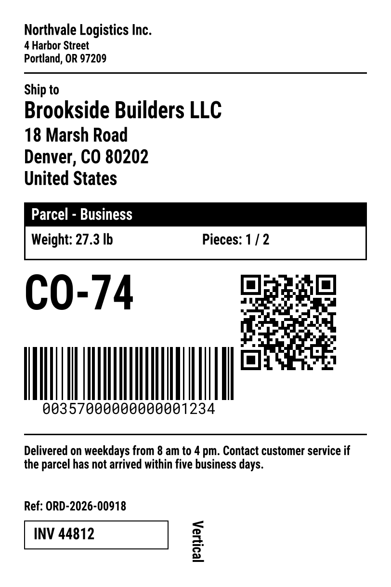
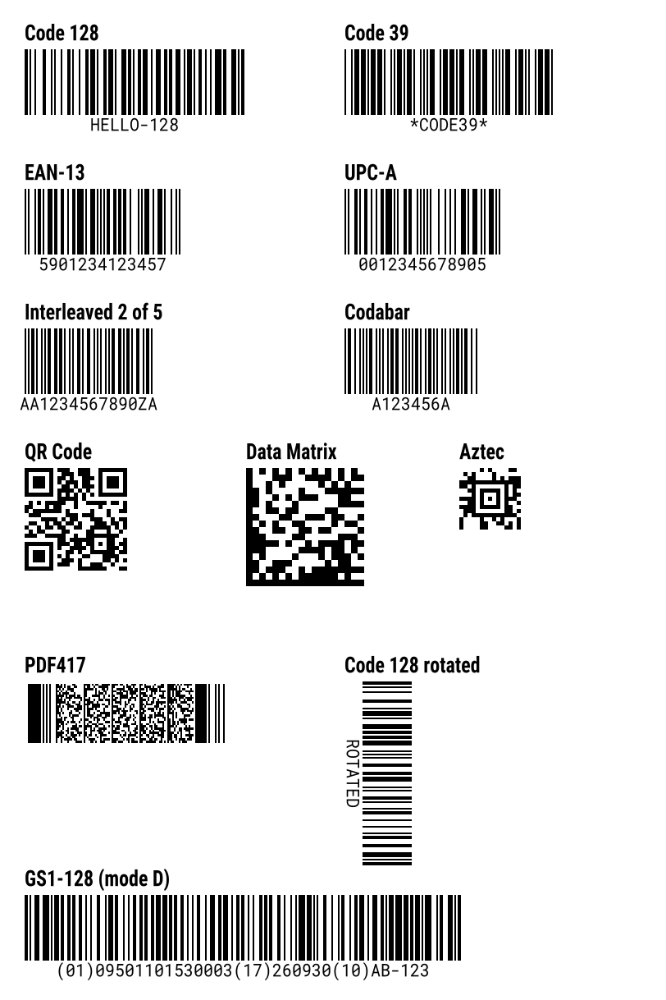
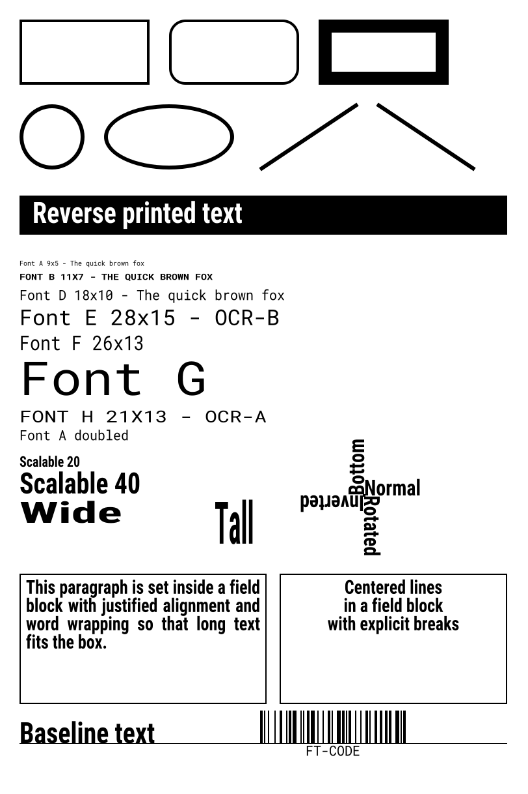
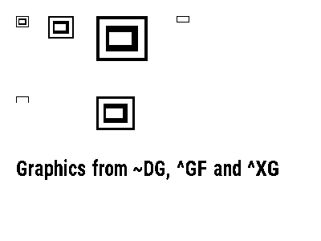
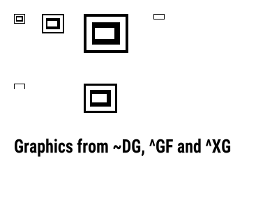
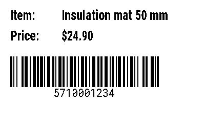
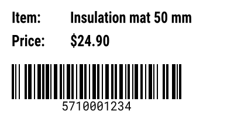
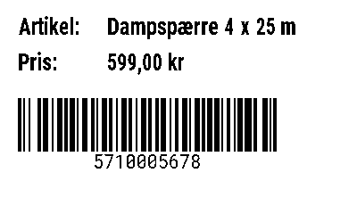
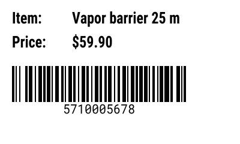

# Examples

Every `.zpl` file in this folder is rendered to a `.pdf`, a `.svg` and a `.png` next to it. A file with several labels gets one SVG and one PNG per label, numbered from 1. Render them again with:

```
composer examples
```

The PNG and the SVG of each label are shown below. GitHub does not preview PDF files inline, so open the PDF links to see the pages.

## Shipping label

Source: [shipping-label.zpl](shipping-label.zpl). Output: [PDF](shipping-label.pdf), [SVG](shipping-label.svg), [PNG](shipping-label.png).

A 4 x 6 inch label with scalable text, boxes, a reverse-printed service bar, a QR code, a Code 128 barcode, a field block and rotated text.

<table>
<tr>
<th>PNG</th>
<th>SVG</th>
</tr>
<tr>
<td valign="top"></td>
<td valign="top"></td>
</tr>
</table>

## Barcodes

Source: [barcodes.zpl](barcodes.zpl). Output: [PDF](barcodes.pdf), [SVG](barcodes.svg), [PNG](barcodes.png).

Every barcode type: Code 128, Code 39, EAN-13, UPC-A, Interleaved 2 of 5, Codabar, QR Code, Data Matrix, Aztec, PDF417, a rotated Code 128 and GS1-128 in mode D.

<table>
<tr>
<th>PNG</th>
<th>SVG</th>
</tr>
<tr>
<td valign="top"></td>
<td valign="top"></td>
</tr>
</table>

## Shapes and fonts

Source: [shapes-and-fonts.zpl](shapes-and-fonts.zpl). Output: [PDF](shapes-and-fonts.pdf), [SVG](shapes-and-fonts.svg), [PNG](shapes-and-fonts.png).

Boxes, circles, ellipses and diagonals, reverse text on a black bar, the bitmap fonts A to H, the scalable font at several sizes and aspect ratios, the four rotations around one `^FT` point, field blocks and text on a typeset baseline.

<table>
<tr>
<th>PNG</th>
<th>SVG</th>
</tr>
<tr>
<td valign="top"></td>
<td valign="top"></td>
</tr>
</table>

## Graphics

Source: [graphics.zpl](graphics.zpl). Output: [PDF](graphics.pdf), [SVG](graphics.svg), [PNG](graphics.png).

A graphic downloaded with `~DG`, recalled with `^XG` at three magnifications and once inverted through `^FR`, next to inline `^GF` graphics in run-length compressed and plain hex form.

<table>
<tr>
<th>PNG</th>
<th>SVG</th>
</tr>
<tr>
<td valign="top"></td>
<td valign="top"></td>
</tr>
</table>

## Stored format

Source: [stored-format.zpl](stored-format.zpl). Output: [PDF](stored-format.pdf), [SVG 1](stored-format-1.svg), [SVG 2](stored-format-2.svg), [PNG 1](stored-format-1.png), [PNG 2](stored-format-2.png).

The first format stores a template with `^DF` and three `^FN` fields, and prints nothing. The next two formats recall it with `^XF` and fill the fields. The last one asks for two copies with `^PQ2`, so the PDF has three pages.

<table>
<tr>
<th>PNG</th>
<th>SVG</th>
</tr>
<tr>
<td valign="top"></td>
<td valign="top"></td>
</tr>
<tr>
<td valign="top"></td>
<td valign="top"></td>
</tr>
</table>
